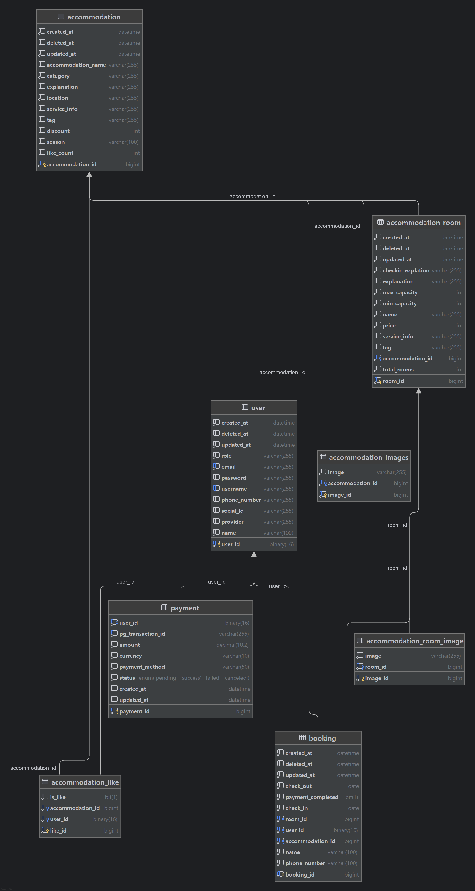

# Ducktel - 숙박 예약 서비스

**Ducktel**은 Spring Boot와 Vue 3를 기반으로 개발된 풀스택 숙박 예약 플랫폼입니다.  
[**Ducktel 바로가기**](https://www.ducktel.uk)<br>
OAuth2 로그인, JWT 기반 인증, 숙소 및 객실 관리, 예약 및 결제 기능을 통해 사용자 중심의 예약 경험을 제공합니다.

Redis를 이용한 리프레시 토큰 저장 및 인증 처리, Kafka를 활용한 메시지 처리 흐름 테스트도 포함되어 있으며,  
프론트엔드는 Vercel을 통해 정적 배포되며, Cloudflare Tunnel을 사용해 로컬 백엔드 서버를 외부에서 접근 가능하도록 구성했습니다.

---

## 프로젝트 구조
```
ducktel/
├── config/
│   └── security/                        # Spring Security 관련 구성
│       ├── config/                    # Security 설정 클래스 (SecurityConfig 등)
│       ├── cookie/                    # 쿠키 기반 인증 처리
│       ├── filter/                    # 커스텀 필터 
│       ├── handler/                   # 로그인/인가 성공 또는 실패 핸들러
│       ├── jwt/                       # JWT 관련 설정 및 유틸
│       └── service/                   # 보안 관련 서비스 (UserDetailsService 등)
│
├── controller/                         # REST API 컨트롤러
│   ├── auth/                          # 인증/로그인 관련 API
│   ├── book/                          # 예약 관련 API
│   ├── home/                          # 홈 화면 관련 API
│   ├── payment/                       # 결제 관련 API
│   ├── place/                         # 숙소 및 객실 관련 API
│   └── user/                          # 사용자 관련 API
│
├── domain/                             # 도메인 계층 (JPA 기반)
│   ├── entity/                        # Entity 클래스 (User, Room 등)
│   └── repository/                    # Repository 인터페이스
│
├── dto/                                # DTO (Data Transfer Object) 클래스들
│
├── enums/                              # Enum 정의 (상태값, 역할 등)
│
├── exception/                          # 예외 처리 (CustomException, Handler 등)
│
├── kafka/                              # Kafka 설정 및 프로듀서/컨슈머
│
├── redis/                              # Redis 설정 및 토큰/캐시 관련 클래스
│
├── service/                            # 비즈니스 로직 서비스
│
├── validation/                         # 입력값 유효성 검증 클래스
│
└── DucktelApplication.java  

```

---

##  인증 및 보안

- **Spring Security**: 보안 설정 및 인증/인가 처리
- **OAuth2 로그인**: 구글 등 소셜 로그인 지원
- **JWT**: 토큰 발급 및 검증 필터 구현
- **Validation**: 입력 데이터 유효성 검사
- 로그인 성공 핸들러: 일반 로그인 및 소셜 로그인 분리 처리

---

##  주요 기능

-  회원가입 / 로그인 (OAuth2 & JWT)
-  숙소 등록 및 조회 (카테고리, 지역별 필터링)
-  객실 등록 및 예약
-  결제 처리
-  예약 내역 확인 및 관리 (변경/취소)
-  사용자 프로필 관리 (조회, 수정, 삭제)
-  비밀번호 재설정

---

## 사용 기술

| 영역             | 기술 스택 및 설명                                                                                 |
|------------------|--------------------------------------------------------------------------------------------|
| **Backend**       | Java 17, Spring Boot, Spring Security, JPA                                                 |
| **인증**          | OAuth2 (Google), JWT, Validation                                                           |
| **Database**      | MySQL                                                                                      |
| **Storage**       | MinIO (스토리지로 이미지 저장), Redis(토큰 관리)                                                         |
| **Frontend**      | Vue 3, Vue Router, Axios, Vite                                                             |
| **Infra / 배포**  | Docker, Docker Compose, Kafka, Vercel (프론트 배포), Cloudflare Tunnel (백엔드 HTTPS 연결), Cloudflare DNS |
| **Version Control** | Git, GitHub                                                                                |
| **빌드 도구**      | Gradle                                                                                     |
[사용기술 정리](https://goose-duck.tistory.com/category/%ED%94%84%EB%A1%9C%EC%A0%9D%ED%8A%B8/ducktel)
---

##  API 엔드포인트
[전체 API 문서 보기 (Postman)](https://documenter.getpostman.com/view/40259480/2sB2qUnQEB)

| 메서드 | 엔드포인트                          | 설명                     | 컨트롤러          |
|--------|---------------------------------|--------------------------|-------------------|
| POST   | `/api/auth/refresh`            | JWT 토큰 갱신            | AuthController    |
| POST   | `/api/auth/logout`             | 로그아웃 처리            | AuthController    |
| GET    | `/api/home`                    | 메인 홈 화면 정보        | HomeController    |
| GET    | `/api/home/{category}`         | 카테고리별 숙소 조회     | HomeController    |
| GET    | `/api/home/{category}/{location}` | 지역 + 카테고리 숙소 조회| HomeController    |
| POST   | `/api/payment/create`          | 결제 정보 생성           | PaymentController |
| GET    | `/api/places/{accommodationId}/{checkInData}/{checkOutData}` | 특정 숙소의 객실 정보 | PlacesController  |
| POST   | `/api/users/register`          | 회원가입                 | UserController    |
| GET    | `/api/users/profile`           | 사용자 프로필 조회       | UserController    |
| PUT    | `/api/users/profile`           | 사용자 프로필 수정       | UserController    |
| DELETE | `/api/users/profile/{userId}`  | 사용자 계정 삭제         | UserController    |
| GET    | `/api/users/book`              | 사용자 예약 목록 조회    | UserController    |
| PUT    | `/api/users/book`              | 예약 변경                | UserController    |
| DELETE | `/api/users/book/{bookingId}`  | 예약 취소                | UserController    |
| POST   | `/api/users/password-reset`    | 비밀번호 재설정 요청     | UserController    |

---
## 설치 및 실행

---

### 1. 필수 환경

- Java 17 이상
- Node.js 18 이상
- Docker + Docker Compose
- MySQL 8 이상
---

### 2. 프로젝트 클론

```bash
git clone https://github.com/bin940/Ducktel.git
cd Ducktel
```
### 3. Docker 실행

```bash
docker-compose up --build
```
### 4. 수동 실행

#### 4.1 백엔드 실행
```bash
cd DuckBack
./gradlew bootRun
```
#### 4.2 프론트엔드 실행
```bash
cd duckfront
npm install
npm run dev
```

### 5. 데이터베이스 설정
```properties
# 백엔드 DB 설정 예시
SPRING_DATASOURCE_URL=jdbc:mysql://localhost:3306/ducktel
SPRING_DATASOURCE_USERNAME=class4
SPRING_DATASOURCE_PASSWORD=1234
```


---
##  ERD
<p style="text-align: center;">
  
</p>

