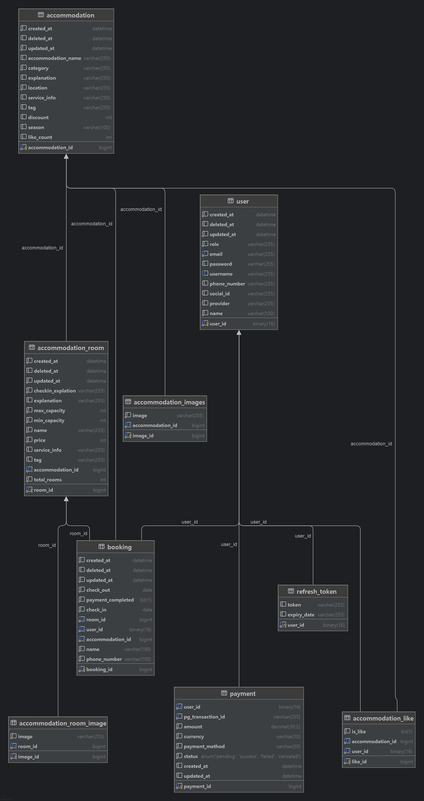

# 🏨 Ducktel - 숙박 예약 서비스

**Ducktel**은 Spring Boot와 Vue3를 기반으로 개발된 풀스택 숙박 예약 플랫폼입니다.  
OAuth2 로그인, JWT 인증, 숙소/객실 관리, 예약 및 결제 기능 등을 포함하며, 사용자 친화적인 예약 경험을 제공하는 것을 목표로 제작되었습니다.

---

## 📁 프로젝트 구조
```
ducktel/
├── config/                      # 설정 관련 패키지
│   ├── security/               # Spring Security 및 JWT 설정
│   │   ├── handler/            # 인증/인가 핸들러
│   │   └── jwt/                # JWT 관련 설정 및 필터
│   └── config/                 # 기타 설정 클래스
├── controller/                 # API 컨트롤러
│   ├── auth/                   # 인증 관련 컨트롤러
│   ├── home/                   # 홈 화면 관련 컨트롤러
│   ├── payment/                # 결제 관련 컨트롤러
│   ├── place/                  # 숙소/객실 관련 컨트롤러
│   └── user/                   # 사용자 관련 컨트롤러
├── domain/                     # 도메인 관련 패키지
│   ├── entity/                 # 도메인 모델 (User, Room, Booking 등)
│   ├── enums/                  # 열거형 클래스
│   ├── repository/             # JPA Repository 계층
│   └── dto/                    # 데이터 전송 객체 (DTO)
├── exception/                  # 예외 처리 관련 패키지
├── service/                    # 비즈니스 로직 서비스
├── validation/                 # 유효성 검사 관련 패키지
└── DucktelApplication.java     # 메인 애플리케이션 클래스
```

---

## 🔐 인증 및 보안

- **Spring Security**: 보안 설정 및 인증/인가 처리
- **OAuth2 로그인**: 구글 등 소셜 로그인 지원
- **JWT**: 토큰 발급 및 검증 필터 구현
- **Validation**: 입력 데이터 유효성 검사
- 로그인 성공 핸들러: 일반 로그인 및 소셜 로그인 분리 처리

---

## ✨ 주요 기능

- ✅ 회원가입 / 로그인 (OAuth2 & JWT)
- 🏠 숙소 등록 및 조회 (카테고리, 지역별 필터링)
- 🛏 객실 등록 및 예약
- 💳 결제 처리
- 📅 예약 내역 확인 및 관리 (변경/취소)
- 👤 사용자 프로필 관리 (조회, 수정, 삭제)
- 🔑 비밀번호 재설정

---

## 🛠 사용 기술

| 영역            | 기술 스택                     |
|----------------|------------------------------|
| **Backend**    | Java, Spring Boot, Spring Security, JPA |
| **인증**       | OAuth2, JWT, Validation      |
| **Database**   | MySQL                        |
| **Storage**    | MinIO (객체 스토리지)         |
| **Frontend**   | Vue3                         |
| **Version Control** | Git                     |
| **빌드 도구**  | Gradle                       |


---

## 🌐 API 엔드포인트

| 메서드 | 엔드포인트                              | 설명                     | 컨트롤러          |
|--------|-----------------------------------------|--------------------------|-------------------|
| POST   | `/api/auth/refresh`                    | JWT 토큰 갱신            | AuthController    |
| POST   | `/api/auth/logout`                     | 로그아웃 처리            | AuthController    |
| GET    | `/api/home`                            | 메인 홈 화면 정보        | HomeController    |
| GET    | `/api/sub-home/{category}`             | 카테고리별 숙소 조회     | HomeController    |
| GET    | `/api/sub-home/{category}/{location}`  | 지역 + 카테고리 숙소 조회| HomeController    |
| POST   | `/api/payment/create`                  | 결제 정보 생성           | PaymentController |
| GET    | `/api/places/{accommodationId}/{checkInData}/{checkOutData}` | 특정 숙소의 객실 정보 | PlacesController  |
| POST   | `/api/users/register`                  | 회원가입                 | UserController    |
| GET    | `/api/users/profile`                   | 사용자 프로필 조회       | UserController    |
| PUT    | `/api/users/profile`                   | 사용자 프로필 수정       | UserController    |
| DELETE | `/api/users/profile/{userId}`          | 사용자 계정 삭제         | UserController    |
| GET    | `/api/users/book`                      | 사용자 예약 목록 조회    | UserController    |
| PUT    | `/api/users/book`                      | 예약 변경                | UserController    |
| DELETE | `/api/users/book/{bookingId}`          | 예약 취소                | UserController    |
| POST   | `/api/users/password-reset`            | 비밀번호 재설정 요청     | UserController    |

---
## 🌍 ERD
